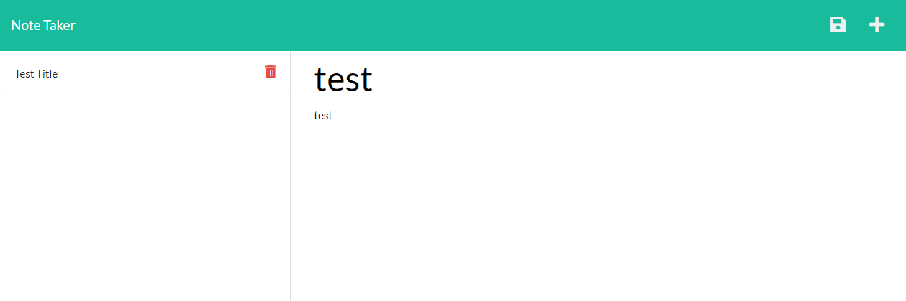
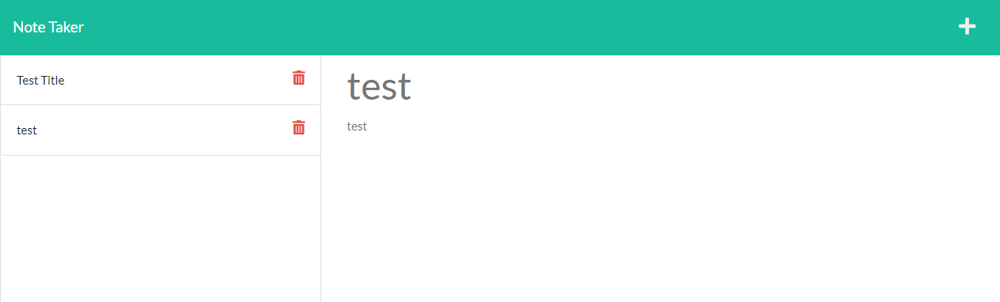

# note-taker
## Description
This is a simple site to allow user to enter notes. 
There is two pages, home and notes page. 
While on the notes page you can enter in new notes. 
Upon saving the notes will be saved to ./db/db.json and the page will update. 
Upon deleting a note the note will be removed from ./db/db.json and the page will update. 

## Deployed Link
https://stormy-eyrie-37675.herokuapp.com/

## Screen shots

## Table of Contents
- [Installation](#installation)
- [Usage](#usage)
- [Contribution](#contribution)
- [Test](#test)
- [License](#license)
- [GitHub](#github)
- [Contact](#contact)

## Installation
type "npm install" in terminal to install dependencies, required for this program to work

## Usage
type "npm start" in terminal to run server, go to http://localhost:3000 to view the site
alternatively just go to deployed link

## Contribution
No need for contribution, solo project.

## Test
Install then use, can enter/delete notes, db.json in db folder will change in realtime.

## License
This project is licensed with MIT License. 

## GitHub
https://github.com/chuanw101

## Contact
- Author: Chuan Wang
- Email: chuan.wang101@gmail.com